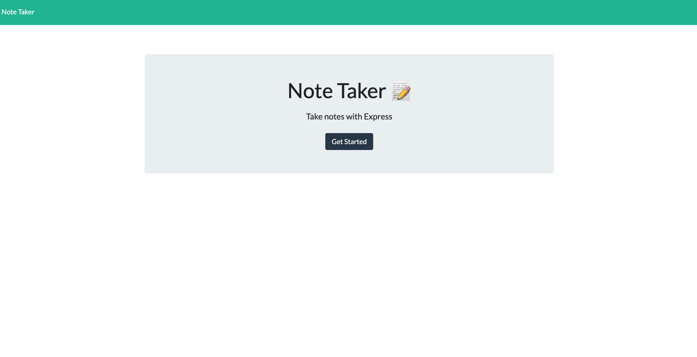

# CH11-Note-Taker

# Description
 An application called Note Taker that can be used to write and save notes. This application will use an Express.js back end and will save and retrieve note data from a JSON file.

# Mock up
The following image shows the appearance of the HTML webpage generated:

# Links

https://git.heroku.com/lit-stream-36281.git